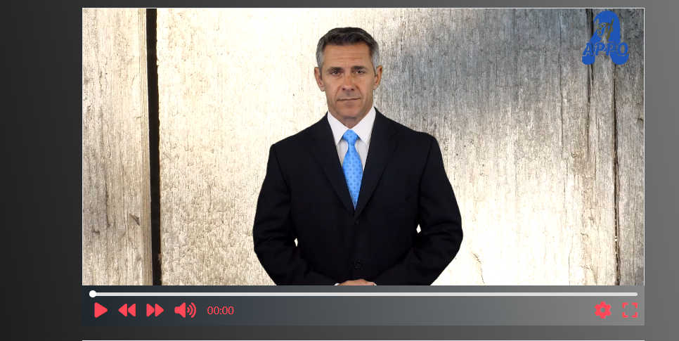
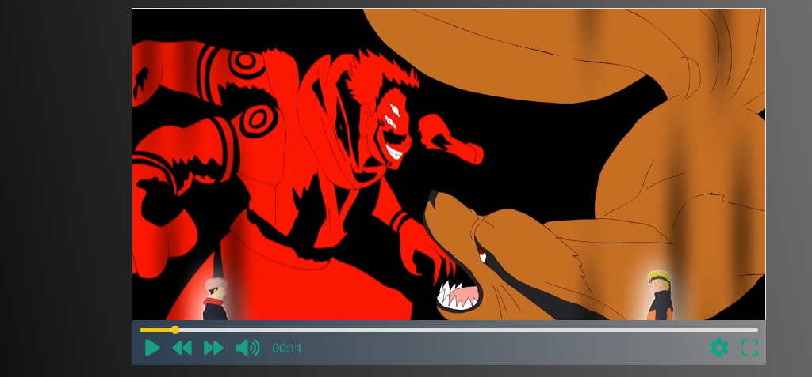
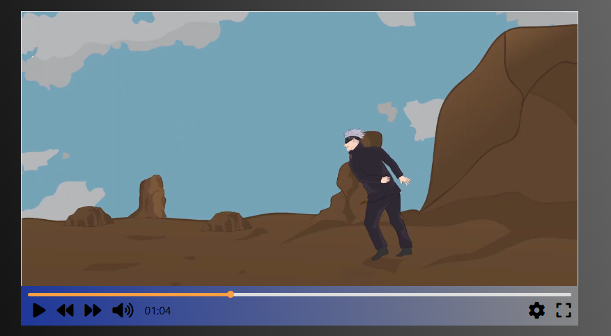

# 🎬 Custom Video Player

A fully customizable **Typescript Video Player** with modern UI, custom themes, and flexible playback controls.

## 🚀 Features

- 🎨 **Custom Themes** (Define colors for background, text, and accent elements)
- ⏩ **Skip Time Control** (Customize forward/backward skip duration)
- 🔊 **Volume & Mute Control**
- 📏 **Responsive Design** (Adapts to different screen sizes)

## 📂 Project Structure

```
📁 VideoPlayer
├── 📄 index.html       # Main HTML file
├── 📁 .git             # Git repository folder
├── 📁 .vscode          # VS Code settings
├── 📁 dist            # Compiled output files
├── 📁 images          # Screenshots and images
├── 📁 src             # Source TypeScript files
├── 📁 videos          # Video files
├── 📄 README.md        # Documentation
├── 📄 tsconfig.json    # TypeScript configuration
```

## 🛠️ Installation

Clone the repository and open `index.html` in your browser:

```bash
git clone https://github.com/yourusername/VideoPlayer.git
cd VideoPlayer
open index.html
```

## 📝 Usage

### Initialize a New Video Player

Create a new instance of the `VideoPlayer` class:

```javascript
const player1 = new VideoPlayer({
    container: 'videoContainer',
    src: './videos/sample.mp4',
    theme: {
        color: '#ffffff',
        background: '#1e272e',
        accent: '#ff4757',
    },
    skipTime: 10,
});
```

### Available Options

| Option      | Type   | Description                      |
| ----------- | ------ | -------------------------------- |
| `container` | String | ID of the HTML container element |
| `src`       | String | Path to the video file           |
| `theme`     | Object | Custom colors for styling        |
| `skipTime`  | Number | Seconds to skip forward/backward |

## 🎨 Theming

Customize the player’s appearance using the `theme` object:

```javascript
theme: {
    color: '#ffffff',        // Text/Icon color
    background: '#1e272e',   // Background color
    accent: '#ff4757'        // Highlight color (buttons, progress bar)
}
```

## 📸 Screenshots

### 🎥 Video Player UI


### 🎥 Video Player UI


### 🎥 Video Player UI


## 🏗️ Contributing

Feel free to submit issues or pull requests to improve this project.


Made with ❤️ by [Mohamed Abdelwahab](https://github.com/mohamedAbdelwahabali5)

